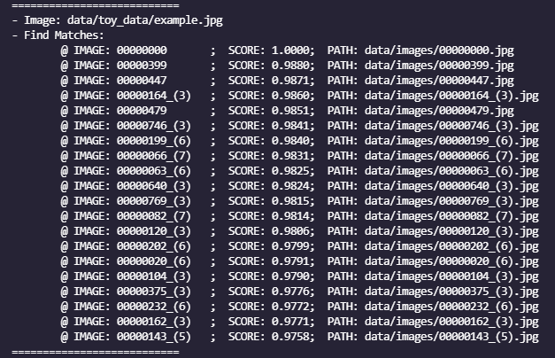
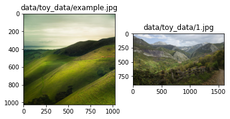

# jina-image_similarity_search-example
Example of similar image neural search using Jina AI

## Overview
| About this example: |  |
| ------------- | ------------- |
| Learnings | Search similar images. |
| Used for indexing | Images |
| Used for querying | Image |
| Dataset used | ["arnaud58/landscape-pictures"](https://www.kaggle.com/arnaud58/landscape-pictures) containing landscape images. (It is possible to download other datasets)|
| Model used | [Resnet50](https://www.tensorflow.org/api_docs/python/tf/keras/applications/resnet50/ResNet50) from Keras Tensorflow|

In the example, Jina is used to implement an image similarity search system. It allows user to search similar images among index dataset using a giving query image.


## 🐍 Build the app with Python

These instructions explain how to build the example yourself and deploy it with Python.


### 🗝️ Requirements

1. A working Python 3.7 or 3.8 environment 
2. An installation of [Docker](https://docs.docker.com/get-docker/). 
3. You have at least 700MB of free space on your hard drive. 

- It is recommended to creat a [new Python virtual environment](https://docs.python.org/3/tutorial/venv.html) or to [install Anaconda](https://docs.anaconda.com/anaconda/install/index.html) to have a clean installation of Jina and prevent dependency conflicts.   

### 👾 Step 1. Clone the repo and install Jina

Begin by cloning the repo, so you can get the required files and datasets. (If you already have the examples repository on your machine make sure to fetch the most recent version)

```sh
git clone git@github.com:NatakuG/jina-image_similarity_search-example.git
cd jina-image_similarity_search-example
````
In your terminal, you should now be located in the *jina-image_similarity_search-example* folder. 

Now install the required python modules.

```sh
pip install -r requirements.txt
```


### 🏃 Step 2. Index your data
To quickly get started, you can index a [small toy dataset](data/toy_data) to make sure everything is working correctly. 

#### - **With toy dataset**
To index the toy dataset, run
```bash
python main.py -t index
```

#### - **With full dataset**

To use a bigger dataset, fetch the dataset with the script *get_data.sh* (it is possible to use other datasets, just make sure the path to the dataset is corret when using it)

1. Register for a free [Kaggle account](https://www.kaggle.com/account/login?phase=startRegisterTab&returnUrl=%2F)
2. Set up your API token (see [authentication section of their API docs](https://www.kaggle.com/docs/api))
3. Run `./get_data.sh` to download the image dataset

```sh
./get_data.sh 
```

The script will download dataset into the folder ['data/images'](data/images)

To index the full dataset, run

```shell
python main.py -t index -d images
```

`-d` or `--data_set` indicates the dataset subfolder name under ['data'](data) folder, change this value to use your own dataset.

### 🔎 Step 3: Query your data

Use command below to start a query with default image:

```sh
python main.py -t query
```

By default the query task will use the image ['example.jpg'](data/toy_data/example.jpg) to search similar images.

```sh
python main.py -t query --query-image 'data/toy_data/example.jpg'
```

Use `--query-image` or `-i` to specify other images to start the query task.





_____

## 🌀 Flow diagram
This diagram provides a visual representation of the Flows in this example; Showing which executors are used in which order.
Remember, our goal is to compare vectors representing the semantics of images with vectors encoding the semantics of short text descriptions.

### Indexing
  
The index flow configuration [Flow configuration](flows/query.yml).


### Querying
  
The query flow configuration [Flow configuration](flows/query.yml).


## 🔮 Overview of the files

|                      |                                                                                                                  |
| -------------------- | ---------------------------------------------------------------------------------------------------------------- |
| 📂 `app/`                  | Folder to store application configuration
| --- 📃 `config.py`         | Application configuration file, including work environment variables
| --- 📃 `app.py`            | Script to start the application 
| 📂 `flows/`                | Folder to store Flow configuration
| --- 📃 `index.yml`         | YAML file to configure indexing Flow
| --- 📃 `query.yml`         | YAML file to configure querying Flow 
| 📂 `executors/`            | Folder to store Flow configuration
| --- 📃 `image_loader.py`   | Image loader executor
| --- 📃 `image_encoder.py`  | Image encoder executor
| 📃 `main.py`               | Main file that runs the example
||
||
| 📂 `data/`                 | Folder to store the datasets for the example
| --- 📂 `toy-data/`         | Folder to store the toy dataset for the example
| --- 📂 `images/`           | Folder to store the dataset downloaded from **get_data.sh**
| 📃 `get_data.sh`           | Script to fetch example dataset
||
||
| 📂 `workspace/`            | Folder to store indexed files (embeddings and documents). Automatically created after the first indexing
| 📂 `visualizations/`       | Folder to store images used for documentation
| 📂 `tests/`      | Tests that check the example's correctness  |

## ⏭️ TODO

- Use transfer learning method to improve the performance. It is possible to train the pretrained ML model with index dataset.
- Use other dataset examples
- Complete other features to improve performance


## 💁‍♂️ Contributor

- [LinkedIn](https://www.linkedin.com/in/peng-gao-fr/) - GP
- [Github](https://github.com/NatakuG) - NatakuG

## 🤖 Jina AI

- [JinaAI](https://jina.ai) - know more about our company, we are fully committed to open-source!
- [Github](https://github.com/jina-ai/jina)
- [Doc](https://docs.jina.ai/)
